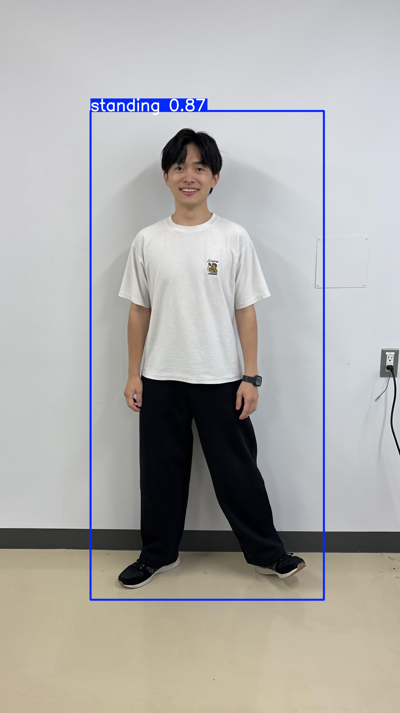

# :memo: YOLOv11 Annotation & Inference Project

機械学習班　第13回輪講　　　　　高橋研究室修士2年　吉崎健司

#### YOLOv11を用いた物体検出の学習と推論を体験的に学ぶことを目的としたパッケージです。アノテーション、学習、推論、可視化まで一貫して体験できます。

<h3>📸 サンプル：学習前 → 学習後</h3>

<table>
  <tr>
    <td></td>
    <td></td>
    <td style="font-size: 32px; text-align: center;">▶</td>
    <td></td>
    <td></td>
  </tr>
  <tr>
    <!-- キャプション -->
    <td align="center"><strong>person</strong></td>
    <td align="center"><strong>person</strong></td>
    <td></td>
    <td align="center"><strong>standing</strong></td>
    <td align="center"><strong>sitting</strong></td>
  </tr>
  <tr>
    <td colspan="2" align="center"><strong>学習前</strong></td>
    <td></td>
    <td colspan="2" align="center"><strong>学習後</strong></td>
  </tr>
  
</table>


### :triangular_flag_on_post: 実装の全体の流れ
1. **環境構築**：必要パッケージのインストール
2. **写真撮影**："立っている" "座っている" 写真を撮る
3. **アノテーション**：`labelImg` でラベル付け（standing/sitting）
4. **学習**：YOLOv11モデルのファインチューニング
5. **推論**：学習済みモデルを使って推論、比較検証


---------------------------------------------------------------------------------
---------------------------------------------------------------------------------

##  1. **環境構築**：必要パッケージのインストール
### ▶ Rinkou_CNNをGithubからクローン
```bash
git clone https://github.com/kenji-88/Rinkou_CNN-YOLO-.git
```
#### ・ ディレクトリ構成

```
Rinkou_CNN/
├── dataset/
│   ├── images/     # アノテーション対象画像
│   └── labels/     # YOLO形式のラベル (.txt)
├── Predict/        # 推論したい画像をここに配置
├── pretrained_models/  # 学習済みモデルを格納
├── train_dataset/  # 分割済みのYOLO用train/validデータ、datasetを学習用と検証用に分けたもの
├── train_yolo.ipynb # 学習、推論を行うファイル
├── PUT_IMAGE_HERE  # スマホで撮った写真を入れるファイル
├── Image_Converter.py # HEIC,PNG形式の画像をJPGに変換
├── setup.sh
├── setup.bat
├── environment.yaml
├── dataset.yaml
```


### ▶ Anaconda仮想環境の作成

#### ・ Linuxの人（Ubuntu / MacOS）
```bash
# 環境構築スクリプトを実行
chmod +x setup.sh
./setup.sh

# 仮想環境の有効化
conda activate rinkoucnn-env
```

#### ・ Windowsの人
```bash
# 環境構築スクリプトを実行
./setup.bat

# 仮想環境の有効化
conda activate rinkoucnn-env
```

必要なPythonパッケージやYOLOリポジトリが自動的にインストールされます。

---------------------------------------------------------------------------------
---------------------------------------------------------------------------------

## 　2. **写真撮影**："立っている" "座っている" 写真を撮る

- "立っている" "座っている" 状態の画像をスマホなどで複数撮影し、`PUT_IMAGE_HERE` フォルダに入れる
-  `Image_Converter.py` を実行し、HEIC形式やPNG形式などをJPGに統一

---------------------------------------------------------------------------------
---------------------------------------------------------------------------------
##  3. **アノテーション**：`labelImg` でラベル付け（standing/sitting）


仮想環境を有効化した上で、以下を実行：
```bash
labelImg
```
- アノテーションする元画像を `dataset/images/` に指定
- アノテーションの座標情報は `dataset/labels/` に保存（YOLO形式）
- 座っている写真には`sitting`、立っている写真には`standing`とラベル付けを行う


---------------------------------------------------------------------------------
---------------------------------------------------------------------------------

##  4. **学習**：YOLOv11モデルのファインチューニング


Notebook `train_yolo.ipynb` により以下を実行：
- train/valid データへの分割
- YOLOによる学習
- `best.pt` に最良の重みを保存
- `results.png` で学習推移を可視化
- `Predict/` 内の画像を自動推論・可視化

---------------------------------------------------------------------------------
---------------------------------------------------------------------------------

##  5. **推論**：学習済みモデルを使って推論


### ▶ 学習済みモデル一覧（ predtrained_models/ ）

- 画像数 （学習用：80、検証用：20）

| モデル名             | imgsz | epoch | batch | 学習時間 |
|---------------------|--------|--------|--------|--------|
| model_640e1b8.pt    | 640    | 1      | 8      |  1 sec  |
| model_640e10b8.pt   | 640    | 10     | 8      |  3 sec  |
| model_640e50b8.pt   | 640    | 50     | 8      |  17 sec |
| model_640e100b8.pt  | 640    | 100    | 8      |  35 sec |
| model_640e200b8.pt  | 640    | 200    | 8      |  1 min  |
| model_640e500b8.pt  | 640    | 500    | 8      |  9 min  |
| model_640e10000b8.pt| 640    | 10000  | 8      |  85 min |
| model_320e100b8.pt  | 320    | 100    | 8      |  50 sec |
| model_1280e100b8.pt | 1280   | 100    | 8      |  2 min  |
| model_1920e100b8.pt | 1920   | 100    | 8      |  5 min  |

### ▶ Notebookで推論実行

Notebook 上では、上のリストからモデルを選び、`Predict/` 内の画像に対して推論＆可視化が行えます。
Notebook の一番下の　`モデルの変更はここ`というところに、上のモデル名を入力して、違いを比較してみてください。
- **imgszが小さい**：速いが粗い
- **epochが多い**：精度向上の代わりに過学習リスク
- **バランス良いモデルは？**：自分で確認してみよう！


